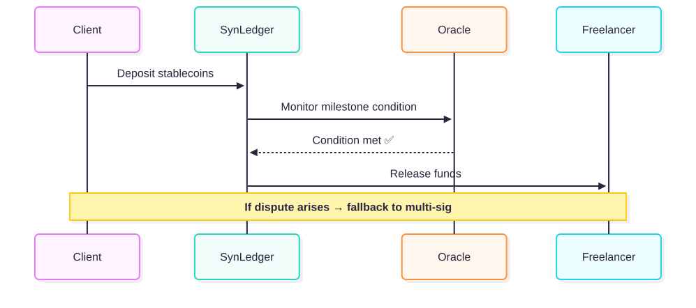

# System Architecture

SynLedger is built on a modular **hybrid escrow contract** stack.  
It’s designed for scalability, flexibility, and composability.

---

## Core Components

| Layer | Function |
|-------|-----------|
| **Smart Escrow Contract** | Manages funds, milestones, and release modes |
| **Oracle Layer** | Integrates with Chainlink/Pyth for data-driven releases |
| **Multi-Sig Layer** | Enables human verification and approvals |
| **Off-Chain Engine** | Provides API, dashboard, and analytics support |

---

## How It Works

1. Client deposits stablecoins into escrow.
2. Smart contract locks funds.
3. Oracle or multi-sig determines release condition.
4. Funds are released when condition met or approved.

---

## Transaction Flow

---

➡️ Next: [Hybrid Escrow Model](./3. hybrid-model.md)
