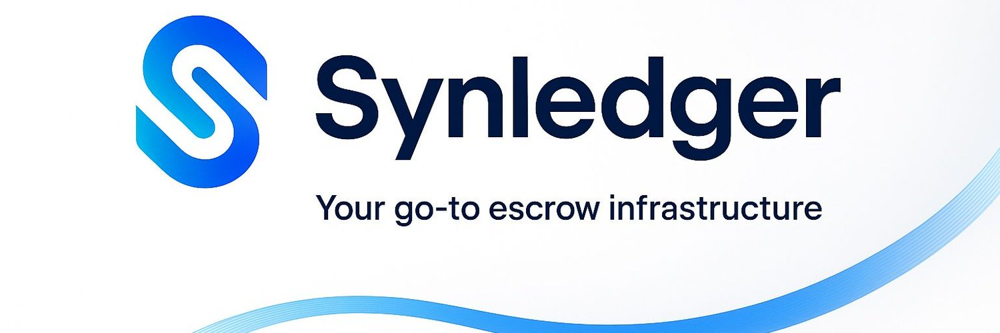

# 🏦 Welcome to SynLedger Docs

> **Programmable Escrow for the Web3 Economy**  
> Flexible, transparent, and developer-ready escrow infrastructure built for the next generation of payments.

---

## What is SynLedger?

**SynLedger** is a hybrid Web3 escrow and payout protocol that combines **multi-sig trust** and **oracle automation** to power programmable payments for:
- Freelancers and agencies  
- DAO bounty systems  
- Web3 marketplaces  
- Digital service contracts  

It’s the **first escrow that adapts to your deal** — giving users the freedom to choose between **manual approval** or **automated oracle releases**, or even both.

---

## Why SynLedger?

Traditional escrow platforms are rigid — either fully manual or fully automated.  
SynLedger changes that by introducing **hybrid escrow logic** that balances *trust and automation*.

| Feature | Traditional Escrow | SynLedger Hybrid |
|----------|--------------------|------------------|
| **Mode** | Manual *or* automated | Configurable per deal |
| **Fallback** | None | Built-in multi-sig safety |
| **Transparency** | Partial | Fully on-chain |
| **Integration** | Closed system | Open SDK + API stack |

> “SynLedger = Stripe + Escrow + Chainlink — unified.”

---

Ready? let's dive right in...

➡️ Next: [Introduction](./1. introduction.md)
