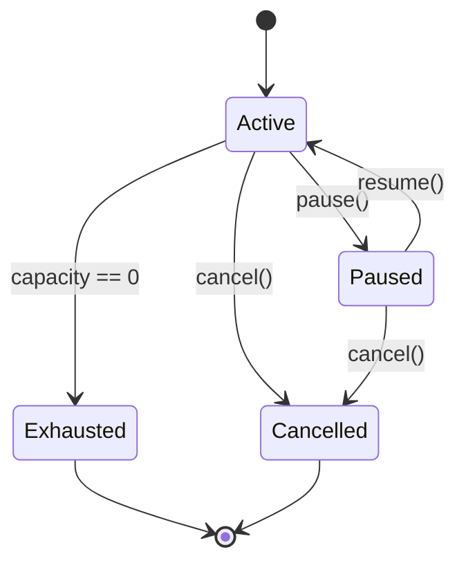
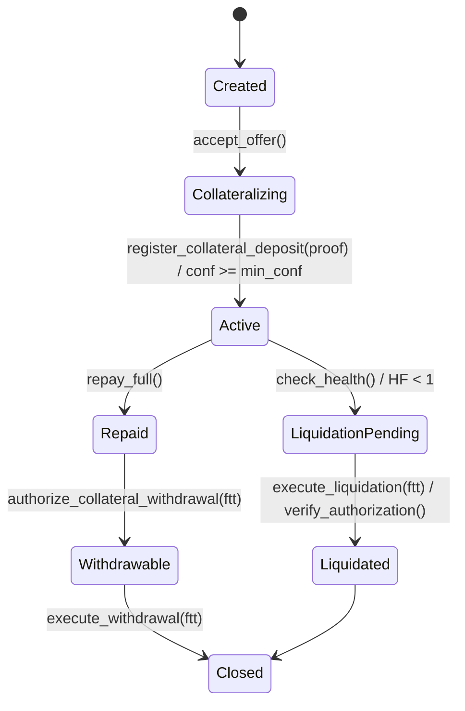

# Zero‑Trust Multi‑Chain Lending Protocol — **Formal Specification v0.1**
*Project code name: ZT‑MCLP*  
*Primary chain: Sui (Move)*  
*Custody primitive: dWallets (Ika 2PC‑MPC)*

---

## 0. Scope & Goals
This document defines the **state machines, events, guards, and sequences** for a zero‑trust, native‑asset lending protocol where:
- Collateral and loans remain **native** on their home chains (e.g., BTC on Bitcoin, ETH on Ethereum).
- **All rights** to move funds are enforced by **Sui smart contracts** that gate dWallet signatures via **2PC‑MPC**.
- Liquidations are **deterministic** and execute as **future transactions** directly on the collateral’s native chain.

Non‑goals (v0.1): yield farming, rehypothecation, credit scores, NFT/RWA collateral (listed as future work).

---

## 1. Terminology
- **Offer**: Lender‑authored loan terms. One‑to‑many matching is allowed if capacity > 1.
- **Loan**: Bilateral agreement (Borrower ↔ Lender) anchored on Sui.
- **dWallet**: Threshold account on an external chain (BTC/ETH/…) whose policy is bound to a Sui Loan.
- **Future Tx Template (FTT)**: Pre‑committed transaction shape executable on the native chain under specific on‑chain conditions.
- **HF (Health Factor)**: `HF = CollateralValue * LT / (DebtValue)`; liquidation allowed if `HF < 1.0`.
- **LT (Liquidation Threshold)**: Parameter per asset/market, usually `LTV + δ`.
- **Oracle Set**: At least two price sources; medianized/validated on Sui.
- **Attestation/SPV Proof**: Evidence of native‑chain balance/transfer used to update Sui state.

---

## 2. Canonical Identifiers
All objects have stable IDs:
- `OfferID = sha3(SuiPackage, creator, nonce)`
- `LoanID = sha3(OfferID, borrower, nonce)`
- `PolicyID = sha3(LoanID, chain, policy_salt)`
- `FTTID = sha3(LoanID, chain, template_bytes)`

---

## 3. On‑Chain Objects (Move)
### 3.1 `OfferObject`
Fields:
- `creator: address`
- `params: OfferParams` (see §9)
- `capacity: u64` (number of loans allowed)
- `status: OfferStatus` (Active | Paused | Exhausted | Cancelled)
- `created_at: u64` (unix ms)
Events:
- `OfferCreated`, `OfferUpdated`, `OfferPaused`, `OfferResumed`, `OfferExhausted`, `OfferCancelled`

### 3.2 `LoanObject`
Fields:
- `offer_id: OfferID`
- `borrower: address`
- `lender: address`
- `collateral: CollateralSpec` (chain, asset, decimals)
- `debt: DebtSpec` (chain, asset, decimals, rate_model_id)`
- `policy_refs: vector<PolicyRef>` (one per external chain used)
- `ftt_refs: vector<FTTRef>` (liquidation, withdrawal, repayment)
- `state: LoanState`
- `acct: Accounting` (principal, interest_index, last_accumulate_at)
- `risk: RiskSnapshot` (hf_cached, last_oracle_round)
- `cfg: LoanConfig` (ltv, lt, liq_bonus, min_conf, …)
- `created_at, updated_at: u64`
Events:
- `LoanCreated`, `CollateralLocked`, `Drawn`, `Repaid`, `LiquidationTriggered`, `LiquidationExecuted`, `Closed`

### 3.3 `PolicyObject` (per chain)
Fields:
- `loan_id: LoanID`
- `chain: ChainId`
- `policy_hash: bytes32` (keccak of policy program)
- `authority: MPCAuthority` (domain binding to Sui pkg+object IDs)
- `status: PolicyStatus` (Active | Revoked)
Events:
- `PolicyBound`, `PolicyRevoked`

### 3.4 `FTTObject` (Future Tx Template)
Fields:
- `template_hash: bytes32`
- `domain: FTDomain` (chain, asset, to_address, amount_bounds, deadline_bounds)
- `kind: FTTKind` (Liquidation | Withdraw | RepayReceipt | Draw)
- `enabled: bool`
Events:
- `FTTRegistered`, `FTTEnabled`, `FTTDisabled`

---

## 4. State Machines

### 4.1 Offer State Machine


Transitions & Guards:
- `pause()` → only `creator`; emits `OfferPaused`.
- `resume()` → only `creator`; emits `OfferResumed`.
- `cancel()` → only `creator`, `capacity == remaining` OR grace rules; emits `OfferCancelled`.
- `match(offer)` → creates `LoanObject`, decrements `capacity`; if `capacity == 0` → `Exhausted`.

---

### 4.2 Loan State Machine


Key Guards:
- `register_collateral_deposit(proof)`: verifies SPV/attestation, chain == expected, amount >= min_collateral.
- `check_health()`: recomputes `HF` with oracle; if `< 1` → emit `LiquidationTriggered`.
- `execute_liquidation(ftt)`: verifies template hash, bounds, authorization proof from Sui; updates accounting.
- `repay(amount)`: partial repay allowed; transition to `Repaid` only when `DebtValue == 0` (±ε).

---

## 5. Oracle & Health
### 5.1 Price Resolution
- Sources: `S1, S2, … Sn` (e.g., Chainlink, Pyth).  
- Aggregation: `P = median(S1..Sn)` after outlier trim (option).
- Divergence guard: if `max_dev(Si, P) > τ` → **halt_liquidations** until convergence or fallback TWAP.

### 5.2 Health Factor
```
CollateralValue = Sum( for each collateral_i ) [ balance_i * price_i * haircuts_i ]
DebtValue       = Sum( for each debt_j )       [ balance_j * price_j ]
HF = (CollateralValue * LiquidationThreshold) / max(DebtValue, ε)
```
- `ε` avoids div‑by‑zero.
- Liquidation allowed iff `HF < 1.0` and `oracles_fresh == true`.

---

## 6. dWallet Policy Model
A **policy program** (off‑chain code, hash anchored on‑chain) enforces:
- Request must contain `(LoanID, PolicyID, FTTID, OracleRound, Nonce, Expiry)`
- Verify **Sui Authorization Proof**: event commitment signed by Move module (package addr + version), including template hash and bounds.
- Enforce **chain‑specific limits**: min/max amount, deadline window, single‑use nonce.
- Only allow **deterministic receivers** (e.g., lender payout address) for Liquidation FTTs.
- Refuse if `Loan.state ∉ {Active, LiquidationPending}` or if authorization expired.

**Security Binding:**  
`policy_hash` is emitted in `PolicyBound(loan_id, chain, policy_hash)` and included in MPC co‑sign context; MPC refuses unknown hashes.

---

## 7. Sequences (Mermaid)

### 7.1 Open Loan (Accept Offer & Collateralize)
```mermaid
sequenceDiagram
    participant B as Borrower
    participant FE as Frontend
    participant S as Sui Contract
    participant O as Oracle Set
    participant MPC as dWallet MPC
    participant C as Collateral Chain (e.g., BTC)

    B->>FE: Select Offer + Accept Terms
    FE->>S: accept_offer(offer_id, borrower,...)
    S-->>FE: LoanCreated(loan_id), PolicyBound, FTTRegistered
    FE->>B: Show deposit address (dWallet on chain C)
    B->>C: Send collateral to dWallet address
    C-->>FE: Txid
    FE->>S: register_collateral_deposit(loan_id, proof(txid, conf))
    S->>O: fetch_latest_prices()
    O-->>S: price_round
    S-->>FE: CollateralLocked(loan_id); state=Active
```

### 7.2 Repay & Withdraw
```mermaid
sequenceDiagram
    participant B as Borrower
    participant S as Sui Contract
    participant MPC as dWallet MPC
    participant D as Debt Chain

    B->>D: Transfer repayment to debt dWallet / lender addr
    B->>S: repay(loan_id, amount)
    S-->>B: Repaid(partial/complete)
    alt debt cleared
      S-->>B: authorize_collateral_withdrawal(FTT)
      B->>MPC: present authorization (FTT, proof)
      MPC->>C: sign & submit withdrawal tx to borrower
      MPC-->>B: txid; Loan->Withdrawable->Closed
    end
```

### 7.3 Liquidation
```mermaid
sequenceDiagram
    participant K as Keeper/Lender
    participant S as Sui Contract
    participant O as Oracles
    participant MPC as dWallet MPC
    participant C as Collateral Chain

    K->>S: check_health(loan_id)
    S->>O: resolve_prices()
    O-->>S: price_round
    alt HF < 1.0 and not halted
      S-->>K: LiquidationTriggered(loan_id, FTTID, bounds)
      K->>MPC: present Sui authorization (event proof + FTTID)
      MPC->>C: sign & broadcast liquidation tx (native collateral -> lender)
      C-->>MPC: txid confirmed
      MPC-->>S: receipt(attestation)
      S-->>K: LiquidationExecuted; state->Liquidated->Closed (if fully repaid by proceeds)
    else HF >= 1.0
      S-->>K: Revert(HF_OK)
    end
```

---

## 8. Invariants & Safety Properties
- **I1 (No Custodial Bypass):** No collateral transfer can occur without a valid **Sui Authorization Proof** linked to `(LoanID, FTTID, oracle_round)` AND a matching `policy_hash`.
- **I2 (Single‑Use Template):** Every FTT has a unique nonce; replay is rejected by MPC and on‑chain.
- **I3 (Accounting Consistency):** `acct.debt_after = max(0, debt_before + interest – repay – liq_proceeds)`; never negative beyond `ε`.
- **I4 (Oracle Freshness):** Price data older than `staleness_limit` cannot be used for liquidation.
- **I5 (Offer Capacity):** `sum(active_loans for offer) ≤ offer.capacity`.
- **I6 (No Privileged Withdrawal):** Only `Withdrawable` state with `FTT(Withdraw)` may move collateral to borrower.

---

## 9. Parameters (per market/asset)
- `LTV_max`
- `LT` (liquidation threshold)
- `liq_bonus` (5–10% typical at genesis)
- `min_conf` (e.g., BTC: 3–6; ETH: 12 blocks)
- `staleness_limit` (e.g., 90s)
- `divergence_tau` (e.g., 2–3% between sources)
- `haircut_volatility`, `haircut_chain` (e.g., reorg risk)
- `rate_model` (kink, base, slope1, slope2)

`OfferParams` includes: accepted collateral set, borrow asset set, max capacity, min/max tenor, rate model, outflow model (Escrowed | Direct), lender payout address (per chain).

---

## 10. Public Interfaces (Move — High Level Signatures)
```
fun create_offer(params: OfferParams) -> OfferID
fun pause_offer(offer: &mut OfferObject)
fun resume_offer(offer: &mut OfferObject)
fun cancel_offer(offer: &mut OfferObject)

fun accept_offer(offer_id: OfferID, borrower: address, cfg: LoanConfig) -> LoanID
fun register_collateral_deposit(loan_id: LoanID, proof: Proof) -> ()
fun draw(loan_id: LoanID, amount: u128) -> ()
fun repay(loan_id: LoanID, amount: u128) -> ()
fun repay_full(loan_id: LoanID) -> ()
fun check_health(loan_id: LoanID) -> HealthEvent
fun liquidate(loan_id: LoanID, max_repay: u128, ftt_id: FTTID) -> ()
fun authorize_collateral_withdrawal(loan_id: LoanID, ftt_id: FTTID) -> ()
fun close(loan_id: LoanID) -> ()
```

Events emitted on each call are canonical and must include `LoanID`, `oracle_round` (if applicable), and `template_hash` (for FTTs).

---

## 11. Proofs & Attestations
Two interchangeable options for `register_collateral_deposit` and liquidation receipts:
- **Option A — SPV/Light Client:** On‑chain verification of headers + Merkle branches for native chains (engineering heavy, trust‑minimized).
- **Option B — Attestation Network:** A committee feeds signed balance/tx proofs to Sui; Move module validates committee threshold. **Launch default** with conservative `LTV_max` and haircuts.

---

## 12. Error Codes (selected)
- `E_OFFER_PAUSED`
- `E_OFFER_EXHAUSTED`
- `E_COLLATERAL_PROOF_INVALID`
- `E_PRICE_STALE`
- `E_PRICE_DIVERGENCE`
- `E_HEALTH_OK`
- `E_POLICY_MISMATCH`
- `E_TEMPLATE_BOUNDS`
- `E_REPLAY`
- `E_STATE_INVALID_TRANSITION`

---

## 13. Metrics & SLAs
- **Liquidation SLA:** time from `LiquidationTriggered` to native‑chain tx inclusion ≤ `T_chain` (per chain benchmark).
- **Oracle Freshness:** % updates within `staleness_limit` ≥ 99%.
- **Authorization Latency:** Sui event → MPC sign start ≤ 1s (target).
- **Failure Rate:** Liquidation execution failures ≤ 0.5% rolling.

---

## 14. Test Vectors (illustrative)
1. **BTC 1.0 collateral, USDC debt 40k, LT=0.7, P_BTC=60k**  
   `CollateralValue=60k`, `Debt=40k`, `HF=(60k*0.7)/40k=1.05` → **No liquidation**.
2. **Price drop to 50k** → `HF=(50k*0.7)/40k=0.875` → **Trigger liquidation** (partial).
3. **Partial liquidation 5k proceeds** → `Debt’=35k`, recompute HF; exit pending if `HF≥1`.

---

## 15. Compliance & Governance Hooks
- **Safety Module** (separate package) can: pause liquidations on specified markets, rotate oracle set, adjust haircuts (time‑locked).
- No module may authorize funds movement directly; only via FTTs bound to policy.

---

## 16. Appendix — Data Schemas (indexer hints)
- `event_loan_created(loan_id, offer_id, borrower, lender, ts)`
- `event_collateral_locked(loan_id, chain, asset, amount, txid, conf)`
- `event_drawn(loan_id, amount, chain)`
- `event_repaid(loan_id, amount, chain)`
- `event_liq_triggered(loan_id, hf, oracle_round)`
- `event_liq_executed(loan_id, proceeds, txid)`
- `event_closed(loan_id)`

---

## 17. Versioning
- v0.1 — Initial formal spec for internal review.
- v0.2 — Add full SPV proof formats, edge‑case guards, full event ABI.
- v1.0 — Audit‑ready spec freeze.
