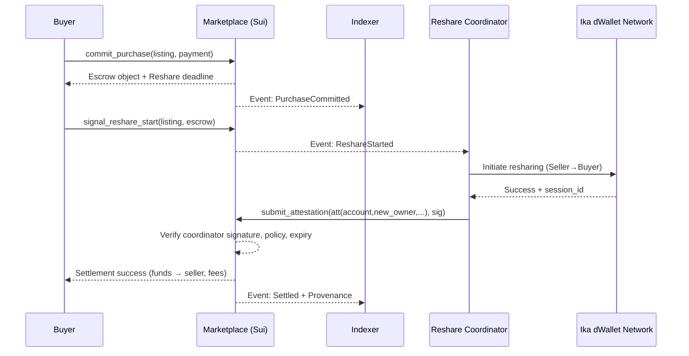
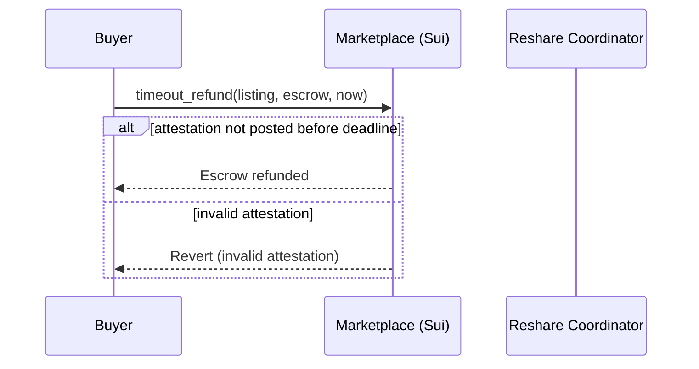

# 🧱 Account Marketplace — Technical Design & Architecture (v0.1)

**Date:** 2025-10-27  
**Scope:** On-chain contracts (Sui / Move), dWallet resharing flow, atomic settlement, provenance, off‑chain services, APIs/SDK, security, testing, and rollout.

---

## 0) TL;DR
We enable **zero‑trust transfer of full accounts** (dWallet‑controlled) through an **atomic, escrowed settlement** plus a **verifiable dWallet key‑reshare attestation**. The marketplace coordinates on‑chain state machines with an off‑chain resharing coordinator (Ika) in a way that ensures: (a) buyer gets exclusive control, (b) seller can’t retain access, and (c) funds settle only if the attestation is valid within a time window.

---

## 1) Architecture Overview

### 1.1 Component Diagram
```mermaid
flowchart LR
  U[Buyer / Seller UI] --> SDK
  SDK -->|tx, queries| MP[Marketplace Contracts (Sui)]
  SDK --> IDX[Indexing Service]
  SDK --> COORD[dWallet Reshare Coordinator]
  IDX --> DB[(Marketplace DB)]
  COORD --> IKA[Ika dWallet Network]
  IKA -->|reshare attestation| COORD
  COORD -->|on-chain proof| MP
  MP --> EV[(Sui Events)]
  IDX --> EV
  COMPL[Compliance/KYC] --> COORD
  VAL[Valuation Service] --> IDX
  NOTIF[Notification Service] --> SDK
```

### 1.2 Core Design Principles
- **Atomicity:** Payment release is **contingent** on an **on‑chain verified reshare attestation**.
- **Zero‑trust:** Seller loses control via **threshold resharing**; no key material touches the marketplace.
- **Programmability:** Listings can encode **transfer policies** (resale rules, cooldowns, buyer classes).
- **Provenance‑first:** Optional **chain‑of‑custody** with privacy toggles.
- **Extensibility:** Pluggable **valuation adapters** and **compliance providers**.

---

## 2) On-Chain Contracts (Sui / Move)

> Use Sui **object‑centric** design with **capabilities** and **event‑rich** state machines.

### 2.1 Key Objects
- `Marketplace`: shared object; global config, fee bps, registered coordinators, valuation/compliance oracles.
- `Listing`: shared object; references `AccountHandle`, price/auction params, policy, status.
- `AccountHandle`: object representing a **transferable dWallet account pointer** plus policy & metadata (no keys on-chain).
- `Escrow`: temporary object holding buyer funds during commit/reshare.
- `ProvenanceRecord`: append‑only records linked to `AccountHandle`.
- `CoordinatorAttestation`: proof object posted by registered coordinator(s) after successful resharing.
- `Offer/Bid`: per‑buyer intent objects (for auctions / offers).

### 2.2 State Machines
**Fixed-Price Flow**
```
Listed -> Committed (escrow funded) -> ReshareInProgress ->
Attested (valid reshare) -> Settled (funds to seller, fees) -> Closed
         \--[timeout/refund]--> Refunded
```

**Auction Flow (English)**
```
Listed(Auction) -> Bids -> AuctionEnd -> HighestBidCommitted -> ReshareInProgress ->
Attested -> Settled -> Closed
           \--[timeout/refund]--> Refunded/NextBidder
```

### 2.3 Critical Entry Points (Move pseudocode)
```move
module account_marketplace::marketplace {
    public entry fun list_account(
        marketplace: &mut Marketplace,
        account: AccountHandle,
        policy: TransferPolicy,
        price: Option<u64>, // None = auction
        auction: Option<AuctionParams>,
    ): Listing { /* emits ListingCreated */ }

    public entry fun commit_purchase(
        marketplace: &mut Marketplace,
        listing: &mut Listing,
        buyer: address,
        payment: Coin<USDC>,
    ): Escrow { /* lock funds, emit PurchaseCommitted */ }

    public entry fun signal_reshare_start(
        listing: &mut Listing,
        escrow: &mut Escrow,
        coordinator: &RegisteredCoordinator,
    ) { /* mark ReshareInProgress, emit ReshareStarted */ }

    public entry fun submit_attestation(
        marketplace: &mut Marketplace,
        listing: &mut Listing,
        escrow: &mut Escrow,
        att: CoordinatorAttestation,
    ) { /* verify attestation, settle or revert; emit Settled/Refunded */ }

    public entry fun timeout_refund(
        listing: &mut Listing,
        escrow: &mut Escrow,
        now_ms: u64,
    ) { /* after T, refund to buyer; emit Refunded */ }

    public fun record_provenance(
        marketplace: &mut Marketplace,
        account: &mut AccountHandle,
        from_addr: address,
        to_addr: address,
        att_digest: vector<u8>,
        opts: ProvenanceOpts,
    ): ProvenanceRecord { /* optional */ }
}
```

### 2.4 Attestation Verification
- `RegisteredCoordinator` holds the **public key / cert** used to sign reshare attestations.
- `CoordinatorAttestation` fields:
  - `account_id`, `old_owner`, `new_owner`, `ikai_session_id`, `expiry`, `nonce`
  - `policy_hash`, `listing_id`, `escrow_id`
  - `sig` (over canonical hash)
- On-chain `submit_attestation()` checks:
  - Valid signature from a **listed coordinator**.
  - Consistent with `listing` + `escrow` state.
  - `expiry` ≥ current time; `nonce` unused.
  - Optional: **multi‑coordinator quorum** (M‑of‑N signatures) for higher assurance.

### 2.5 Atomic Settlement
- If attestation validates:  
  - `Escrow` → pay out to seller; fee skim to `Marketplace` treasury.  
  - `AccountHandle.owner` → update to `buyer`.  
  - `ProvenanceRecord` appended (if enabled).
- If timeout without valid attestation: **refund buyer**.

### 2.6 Policies
`TransferPolicy` (stored on Listing/AccountHandle):
- `resale_allowed: bool`
- `cooldown_ms: u64`
- `buyer_class: Option<BuyerClass>` (e.g., verified, region‑limited)
- `transfer_frequency_limit: Option<u32>`
- `custom_rules_hash: vector<u8>` (off‑chain ruleset proof)

**Enforcement:** Checked at `list_account()` and `submit_attestation()`.

---

## 3) Off-Chain Services

### 3.1 Reshare Coordinator
- Drives Ika dWallet **resharing ceremony** between Seller → Buyer.
- Emits **session events** and produces a **signed attestation** upon success.
- Interfaces:
  - **Inbound:** `signal_reshare_start` (Sui event subscription kicks off ceremony).
  - **Outbound:** `submit_attestation` (on-chain call) and Webhook → UI/SDK.
- Integrations:
  - **Compliance/KYC**: verify buyer/seller when required by policy.
  - **Anomaly checks**: heuristics for risky accounts (optional).

### 3.2 Indexer
- Consumes Sui events (`ListingCreated`, `Committed`, `ReshareStarted`, `Settled`, `Refunded`, `ProvenanceAppended`).
- Builds searchable views for UI/API.
- Stores **account metadata** snapshots (public only; sensitive data stays off-chain).

### 3.3 Valuation Service
- **Adapters**: on-chain oracles (prices), DeFi position parsers, game/account‑specific scorers.
- **Models**: rules + ML for illiquid components (SBT scores, veToken lock value, airdrop reputation).
- Outputs: `valuation_score`, `confidence`, `explanations`.

### 3.4 Compliance/KYC
- Optional. Issues **verifiable credentials** / status flags used by policy checks.
- Can produce **zero‑knowledge proofs** (future) for privacy‑preserving eligibility.

### 3.5 Notifications
- Webhooks, email, and wallet notifs for: bids, outbids, commit, reshare start, settlement, refunds, cooldown unlock.

---

## 4) Data Model (Off-Chain DB)

```sql
-- listings
id (pk), listing_object_id, account_id, seller_addr, type, price, reserve_price,
status, policy_hash, created_at, ends_at, escrow_id, valuation_score, valuation_snapshot

-- accounts (metadata cache; no secrets)
account_id (pk), current_owner, chain_ids, tags, reputation_score, last_transfer_at

-- escrows
escrow_id (pk), buyer_addr, amount, currency, status, deadline_ms

-- attestations
attestation_id (pk), listing_id, escrow_id, account_id, old_owner, new_owner,
ikai_session_id, expiry, nonce, sig, verified, created_at

-- provenance
id (pk), account_id, from_addr, to_addr, att_digest, timestamp, visibility
```

---

## 5) SDK (TypeScript)

```ts
type ChainId = "sui:testnet" | "sui:mainnet";

interface ListAccountParams {
  accountId: string;
  policy: TransferPolicy;
  price?: string;           // fixed
  auction?: AuctionParams;  // english/descending
}

interface BuyParams {
  listingId: string;
  maxPrice: string;
}

interface Events {
  onReshareStarted?: (e:{listingId:string, escrowId:string}) => void;
  onAttested?: (e:{listingId:string, escrowId:string}) => void;
  onSettled?: (e:{tx:string}) => void;
  onRefunded?: (e:{reason:string}) => void;
}

export class AccountMarketSDK {
  constructor(cfg:{rpc:string, chain:ChainId}) {}
  listAccount(p: ListAccountParams): Promise<{listingId:string}>;
  commitPurchase(p: BuyParams): Promise<{escrowId:string, deadline:number}>;
  startReshare(listingId:string): Promise<void>; // triggers coordinator
  waitForSettlement(listingId:string, cb?:Events): Promise<{status:"SETTLED"|"REFUNDED"}>;
  getListing(listingId:string): Promise<ListingView>;
  getProvenance(accountId:string): Promise<ProvRecord[]>;
}
```

---

## 6) Sequence Diagrams

### 6.1 Fixed-Price Purchase


### 6.2 Timeout Refund


---

## 7) Security Model & Threat Analysis

### 7.1 Threats
- **Oracle/Coordinator spoofing:** counterfeit attestations.
- **Race conditions / MEV:** front‑running `commit_purchase`/`submit_attestation`.
- **Griefing:** seller/buyer stalls resharing to lock funds.
- **Replay attacks:** reuse old attestation.
- **Policy bypass:** selling to ineligible buyers.
- **Privacy leakage:** exposing sensitive account relationships.

### 7.2 Mitigations
- **Coordinator Registry** with **rotatable keys**, optional **M‑of‑N quorum**.
- **Attestation nonces + expiry**; bind to specific `listing_id` & `escrow_id`.
- **Escrow deadlines** with **buyer‑side refunds**, seller cannot steal funds.
- **Commit‑reveal** for sealed bids; **anti‑sniping** extensions for auctions.
- **Rate limits / cooldown** encoded in `TransferPolicy`.
- **Selective disclosure** in UI; **ZK‑eligibility proofs** roadmap.
- **Event indexing** for anomaly detection & fraud scoring.

### 7.3 Auditing & Formal Checks
- Move prover specs for invariants:
  - `escrow.amount` conserves value.
  - Attestations must match registered coordinator(s).
  - Only **one** settlement per listing.
- Fuzz tests for state machine edges.

---

## 8) Gas, Fees, and Economics
- **Fees:** `fee_bps` skimmed on settlement; separate **coordinator fee** off‑chain or on‑chain.
- **Refund gas:** caller pays, but refund returns escrowed principal.
- **Revenue:** marketplace fee + premium listing/verification services.
- **Incentives:** discounts for verified clean accounts; optional loyalty points.

---

## 9) Testing Plan

### 9.1 Unit (Move)
- Listing lifecycle, escrow math, attestation verification, timeout refund, policy enforcement.

### 9.2 Integration (Localnet/Testnet)
- End‑to‑end **Seller→Buyer** transfer under: success, invalid signature, expired attestation, policy fail, double‑submit.

### 9.3 Chaos / Adversarial
- Coordinator key rotation mid‑flow; network partitions; spam listings; MEV simulation.

### 9.4 Tooling
- Local Ika coordinator **mock** to generate attestations.
- Deterministic fixtures for valuation/compliance adapters.

---

## 10) Rollout Plan

1. **MVP (Testnet)**: Fixed‑price only, single coordinator, basic provenance log.
2. **V1**: Auctions + offers, valuation adapters, SDK public beta.
3. **V1.1**: Multi‑coordinator quorum; ZK‑eligibility optional.
4. **Audit**: Marketplace + attestation path.
5. **Mainnet**: Gradual, with coordinator SLAs and on‑call runbooks.

---

## 11) Open Questions
- Should we enforce **custody cooldown** post‑transfer for certain asset classes?
- What is the minimal **attestation schema** acceptable to Ika for verifiability?
- Do we need **seller collateral** to deter griefing in auctions?

---

## 12) Appendix — Move Struct Sketches
```move
struct TransferPolicy has copy, drop, store {
  resale_allowed: bool,
  cooldown_ms: u64,
  buyer_class: u8, // 0:any, 1:verified, etc.
  transfer_freq_limit: u32,
  custom_rules_hash: vector<u8>,
}

struct AccountHandle has key, store {
  id: UID,
  owner: address,
  chain_ids: vector<u64>,
  policy_hash: vector<u8>,
  metadata_uri: vector<u8>, // off-chain meta
}

struct Listing has key, store {
  id: UID,
  account_id: ID,
  seller: address,
  price: u64,
  auction: Option<AuctionParams>,
  status: u8, // 0:Listed,1:Committed,2:Reshare,3:Settled,4:Refunded,5:Closed
  escrow_id: Option<ID>,
  policy_hash: vector<u8>,
  deadline_ms: u64,
}
```
---

**End of document.**
